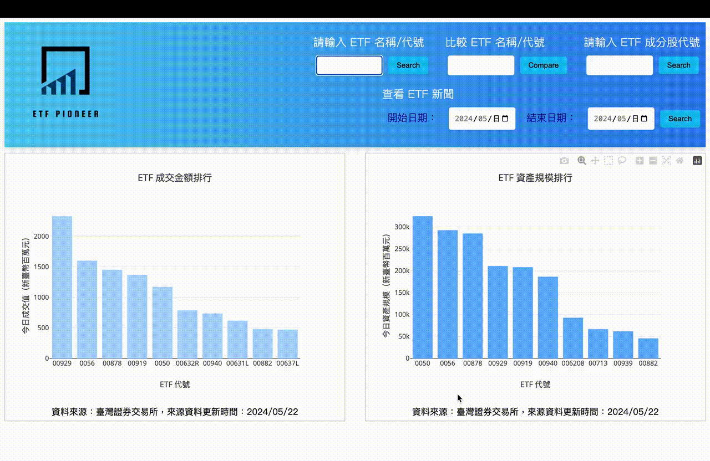
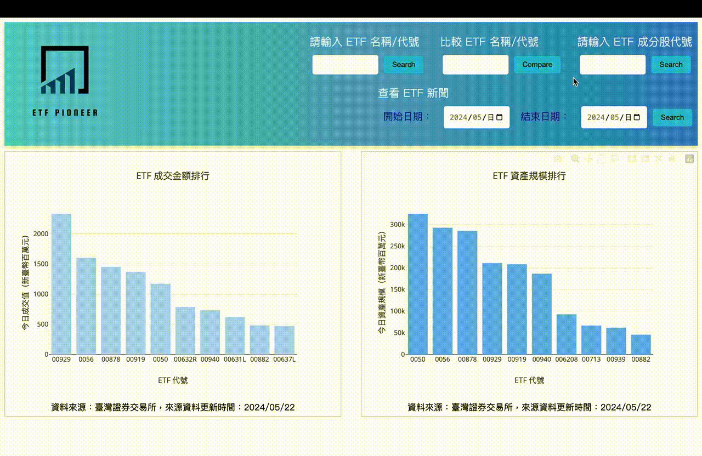

# ETF Pioneer

ETF Pioneer 是一個提供 ETF 排名、資料搜尋、比較、個股反查和 ETF 新聞整合的綜合資訊服務網站，旨在提升使用者的投資決策能力。

ETF Pioneer is a website featuring ETF rankings, data search, comparison, stock lookup, and news aggregation to enhance user investment decisions.
* Website: [https://etf-pioneer.services/](https://etf-pioneer.services/)
* Full Demo: [https://youtu.be/m-WIfyfHKTk?si=-9hdtTWSlbcSWTtb](https://youtu.be/m-WIfyfHKTk?si=-9hdtTWSlbcSWTtb)

## 目錄 Table of Contents
- [問題陳述 Problem Statement](#問題陳述-problem-statement)
- [功能 Features](#功能-features)
- [架構 Architecture](#架構-architecture)
- [Live Demo](#live-demo)
- [工具 Tools](#工具-tools)
- [聯繫 Contact](#聯繫-contact)

## 問題陳述 Problem Statement

網站目標是解決因大規模資料帶來的耗時且不靈活的搜尋挑戰，提供一個高效且使用者友善的 ETF 資訊整合服務平台。

Aiming to solve the time-consuming and inflexible search challenges posed by large-scale data, providing efficient and user-friendly ETF information services.

[top](#目錄-table-of-contents)

## 功能 Features

* **ETF 排名**
  以成交金額、資產規模、受益人數、年初至今績效視覺化呈現 ETF 排名。
  Visualize ETF rankings based on multiple performance indicators.  
  Live Demo: [ETF 排名 (ETF Rankings)](#etf-排名-etf-rankings)

* **搜尋 ETF**
  輸入 ETF 名稱或是代號進行搜尋。
  Search for ETFs by name or ticker.  
  Live Demo: [搜尋 ETF (Search ETFs)](#搜尋-etf-search-etfs)

* **比較 ETF**
  同時比較兩檔 ETF 數據。
  Compare ETFs side-by-side.  
  Live Demo: [比較 ETF (Compare ETFs)](#比較-etf-compare-etfs)

* **個股反查 ETF**
  輸入個股名稱或代號反查 ETF 中含有該檔個股的比例。
  Identify ETFs containing specific stocks.  
  Live Demo: [從股票找到 ETF (Find ETFs from Stocks)](#個股反查-etf-find-etfs-from-stocks)

* **ETF 新聞整合與關鍵字文字雲**
  ETF 新聞整合與關鍵字文字雲呈現。
  Stay updated with ETF-related news.  
  Live Demo: [ETF 新聞整合與關鍵字雲 (ETF News Aggregation and Keyword Cloud)](#etf-新聞整合與關鍵字文字雲-etf-news-aggregation-and-keyword-cloud)

[top](#目錄-table-of-contents)
  
## 架構 Architecture

系統架構圖 System Architecture Overview

#### EC2 A: 資料爬取和處理伺服器 EC2 A: Data Crawling and Processing Server
EC2 A 被配置為使用 Apache Airflow 進行 ETL（抽取、轉換、載入）技術的資料爬取管道，以處理從各個網站爬取的資料。初步爬取的所有資料在轉換階段都存儲在 Amazon S3 存儲桶中。經過規範化後，資料最終被存儲到 MySQL 資料庫中。
EC2 A is configured as a data crawling pipeline using Apache Airflow for ETL (Extract, Transform, Load) techniques to process data scraped from various websites. Initially, all scraped data is stored in an Amazon S3 bucket during the transformation phase. After normalization, the data is finally saved into a MySQL database.

#### EC2 B: 前端伺服器 EC2 B: Frontend Server EC2
EC2 B 負責前端網站佈局，使用 Flask 框架高效管理大量的客戶端請求。此伺服器與伺服器 A 使用同一資料庫連接，使其能夠訪問資料庫表格並在回應客戶端請求時檢索所需的資料。NGINX 被用作反向代理以提升伺服器性能和安全性。
EC2 B handles the frontend website layout, efficiently managing a high volume of client requests using the Flask framework. This server is interconnected with the same database used by Server A, enabling it to access database tables and retrieve the required data in response to client requests. NGINX is used as a reverse proxy to enhance server performance and security.

#### 監控 Monitoring
使用 Amazon CloudWatch 監控資料管道和伺服器，記錄錯誤並確保資料管道在爬取期間 100% 完成。它持續檢查前端網站狀態。對於每日的爬取操作，如果出現任何問題，它會自動發送 Slack 通知。
Amazon CloudWatch is used to monitor the data pipeline and server, logging errors and ensuring 100% completion of the data pipeline during scraping. It continuously checks the frontend website status. For daily crawling operations, it automatically sends Slack notifications if any issues arise.

#### 資料備份 Data Backup
處理後的資料除了存儲在 MySQL 資料庫中，還會備份到 Amazon S3 以確保資料的安全性和穩定性。
Processed data, in addition to being stored in the MySQL database, is also backed up to Amazon S3 to ensure data security and persistence.

#### DevOps
使用 GitHub Actions 進行持續整合（CI）和持續部署（CD），以驗證通過單元測試的無錯誤代碼。在測試成功後，會觸發下一個部署作業，將代碼部署到 AWS EC2 伺服器上。
GitHub Actions is utilized for Continuous Integration (CI) and Continuous Deployment (CD) to verify error-free code passing unit tests. Upon successful test completion, the next deployment job is triggered to deploy the code to an AWS EC2 server.

此架構確保從資料爬取到前端展示的順暢和可靠的流程，包括資料處理、備份、監控和自動化部署，確保整個系統運行順暢且高效。
This architecture ensures a seamless and reliable flow from data crawling to frontend presentation, including data processing, backup, monitoring, and automated deployment, ensuring the entire system runs smoothly and efficiently.

[top](#目錄-table-of-contents)

## Live Demo

#### ETF 排名 (ETF Rankings)
以成交金額、資產規模、受益人數、年初至今績效進行排名。 Users can visualize ETF rankings based on multiple performance indicators. 

[top](#功能-features)

#### 搜尋 ETF (Search ETFs)
輸入 ETF 名稱或是代號搜尋最近交易日的交易價格、不同時間尺度下的績效數據、ETF 組成的產業佔比、 ETF 前十大成分股佔比。 Users can search for ETFs by name or ticker. 

[top](#功能-features)

#### 比較 ETF (Compare ETFs)
同時比較兩檔 ETF ，輸入之後可以查看兩檔 ETF 的績效以及產業分布與前十大成分股組成，例如追蹤大盤的「0050 元大台灣50」以及以高股息為主要特色的「0056 元大高股息」，在不同指標上便能立即顯示差異。 Users can compare ETFs side-by-side. 

[top](#功能-features)

#### 個股反查 ETF (Find ETFs from Stocks)
輸入個股名稱或代號，反查哪些 ETF 中含有該檔個股，以台積電（代號：2330）為例，按下搜尋後會出現含有台積電的各檔 ETF 並按照比例由大到小排列。 Users can identify ETFs containing specific stocks. 

[top](#功能-features)
  
#### ETF 新聞整合與關鍵字文字雲 (ETF News Aggregation and Keyword Cloud)
選擇時間，查看特定區間下的 ETF 相關新聞並可點選查看新聞內文，並輔以新聞關鍵字文字雲，作為投資參考依據。 Users can stay updated with ETF-related news. 

  
[top](#目錄-table-of-contents)

## 工具 Tools
* 程式語言 Programming Languages: Python, JavaScript
* 流程管理 Workflow Management: Apache Airflow
* 資料庫 Database: MySQL
* 容器化服務Container: Docker
* 框架 Frameworks: Flask
* 反向代理 Reverse Proxy: Nginx
* 資料視覺化 Data Visualization Tool: Plotly
* 雲服務 Cloud Services - AWS: EC2, S3, RDS
* 監控 Monitoring Tools - AWS: CloudWatch
* 通知 Notification: Slack
* 自動化 CI/CD Tools: GitHub Actions

[top](#目錄-table-of-contents)
  
## 聯繫 Contact

Chuwen Tan 
* Email: chuwen.tan33@gmail.com 
* LinkedIn: https://www.linkedin.com/in/chuwentan/
