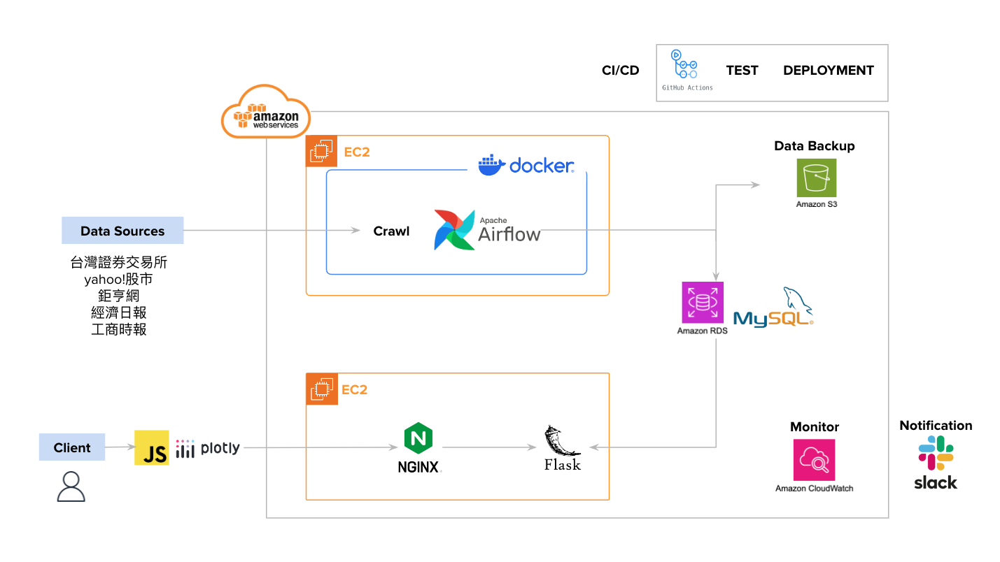

# ETF Pioneer

ETF Pioneer is a website featuring ETF rankings, data search, comparison, stock lookup, and news aggregation to enhance user investment decisions.

## Table of Contents

## Architecture

System Architecture Overview

#### EC2 A: Data Crawling and Processing Server
EC2 A is configured as a data crawling pipeline using Apache Airflow for ETL (Extract, Transform, Load) techniques to process data scraped from various websites. Initially, all scraped data is stored in an Amazon S3 bucket during the transformation phase. After normalization, the data is finally saved into a MySQL database.

#### EC2 B: Frontend Server
EC2 B handles the frontend website layout, efficiently managing a high volume of client requests using the Flask framework. This server is interconnected with the same database used by Server A, enabling it to access database tables and retrieve the required data in response to client requests. NGINX is used as a reverse proxy to enhance server performance and security.

#### Monitoring
Amazon CloudWatch is used to monitor the data pipeline and server, logging errors and ensuring 100% completion of the data pipeline during scraping. It continuously checks the frontend website status. For daily crawling operations, it automatically sends Slack notifications if any issues arise.

#### Data Backup
Processed data, in addition to being stored in the MySQL database, is also backed up to Amazon S3 to ensure data security and persistence.

##### DevOps
GitHub Actions is utilized for Continuous Integration (CI) and Continuous Deployment (CD) to verify error-free code passing unit tests. Upon successful test completion, the next deployment job is triggered to deploy the code to an AWS EC2 server.

This architecture ensures a seamless and reliable flow from data crawling to frontend presentation, including data processing, backup, monitoring, and automated deployment, ensuring the entire system runs smoothly and efficiently.

## Features

#### Users can visualize ETF rankings based on multiple performance indicators.
- [Feature 1: ETF 排名](ReadmeMaterial/feature_1_ETF_ranking_updated.gif)

#### Users can search for ETFs by name or ticker.
- [Feature 2: 搜索 ETF](ReadmeMaterial/feature_2_search_an_ETF_updated.gif)

#### Users can compare ETFs side-by-side.
- [Feature 3: 比較 ETF](ReadmeMaterial/feature_3_compare_ETFs.gif)

#### Users can identify ETFs containing specific stocks.
- [Feature 4: 從股票找到 ETF](ReadmeMaterial/feature_4_find_ETF_from_stock_updated.gif)
  
#### Users can stay updated with ETF-related news.
- [Feature 5: ETF 新聞整合與關鍵字文字雲](ReadmeMaterial/feature_5_ETF_news_aggregation_and_keyword_word_cloud.mov)
  
## Demo

Insert gif or link to demo

## Technologies Used
* Programming Languages: Python, JavaScript
* Database: MySQL
* Frameworks: Flask
* Web Server: Nginx
* Data Visualization Tool: Plotly
* Cloud Engineering - AWS: EC2, S3, RDS
* Monitoring Tools - AWS: CloudWatch
* Notification: Slack
* CI/CD Tools: GitHub Actions
## Contact

Chuwen Tan 
* Email: chuwen.tan33@gmail.com 
* LinkedIn: https://www.linkedin.com/in/chuwentan/
